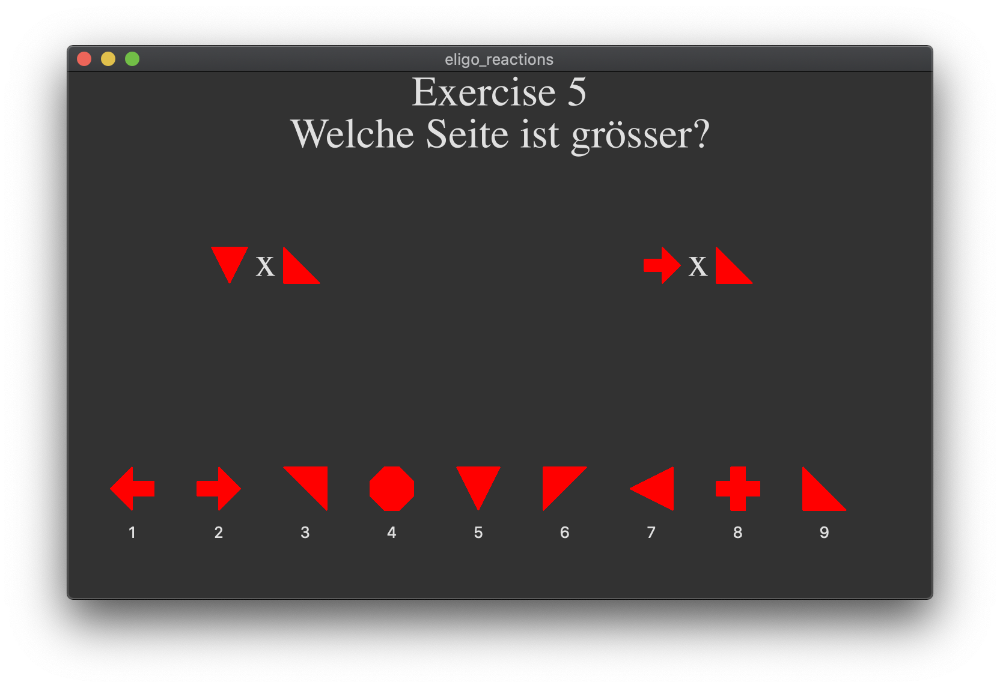

# eligo reactions game
Eligo game for testing and exercising reaction time



Keys: [Left] for left block, [Right] for right block, [Space] for next exercise


## Installation
```
git clone https://github.com/simon-schaefer/eligo_reactions.git
cd eligo_reactions
virtualenv -p python3 .venv
source .venv/bin/activate
pip3 install -r requirements.txt
```

## Execution
```
python3 main.py
```